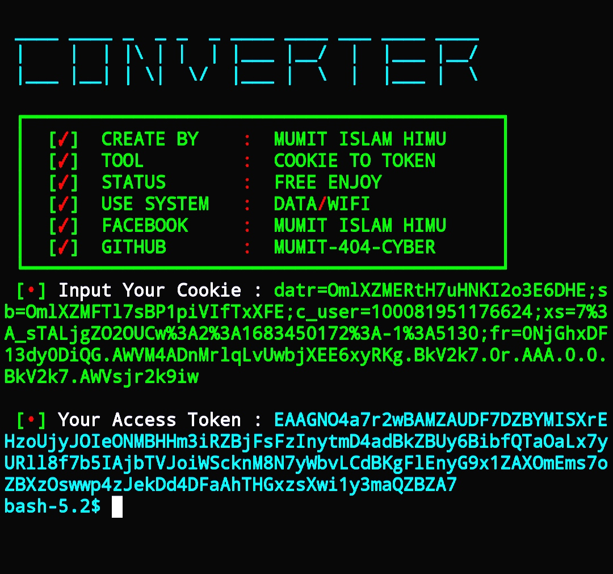

<h2>COMMAND_RUN 🔻 </h2>

[](https://git.io/typing-svg)

```
pkg update && pkg upgrade
pkg install git
pkg install python
pip install requests

rm -rf COOKIE-TO-TOKEN
git clone https://github.com/MUMIT-404-CYBER/COOKIE-TO-TOKEN
cd COOKIE-TO-TOKEN
python Run.py
```

___This Tools is Free Enjoy Dear User.___</br>

## __SCREENSHOT__🔻
<br>
<p align="center">

</p>
